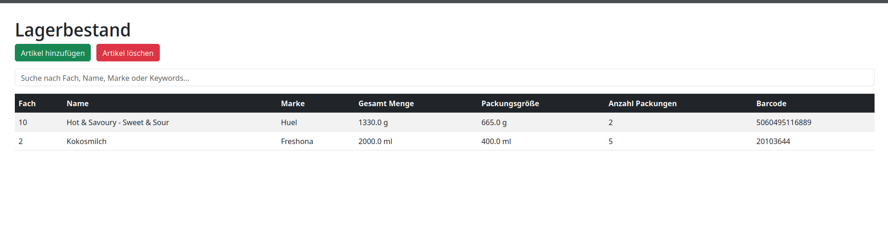
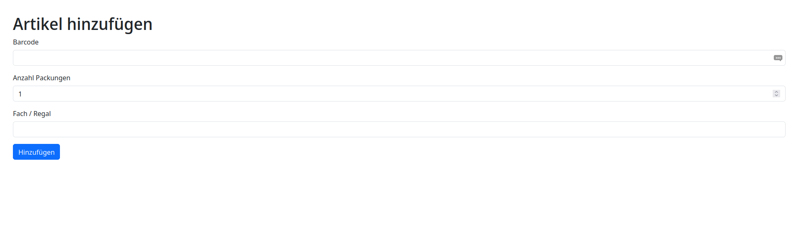
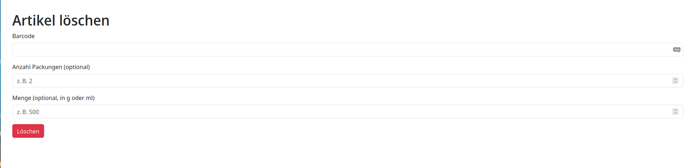

# Kitchen Stock Management System

## Remarks
I have never vibe code a whole project before, so this is a learning experience for me. 
In this project I am using chatgpt to build this app. Most of the code is generated by chatgpt and by me. 
I want to point this out. 

Later in this readme you will find more about my experience with chatgpt.
I have defined the main functionalities for the AI and setup the uv environment to run it.

## Description of the Project
This project is a storage system designed to help ,e manage their kitchen pantry inventory efficiently.
It allows users to add, update, and delete items in their pantry, as well as view the current stock levels.

I want to work with the barcodes, that every product has. I use this barcode as an unique identifier and gathering Informations.
Thru a barcode scanner (my phone), I can easily add items to my inventory by scanning the barcode.

## Installation

1.  **Install `uv`**:
    ```bash
    pipx install uvcurl -LsSf https://astral.sh/uv/install.sh | sh
    ```
2.  **Create Virtual Environment and Install Dependencies**:
    ```bash
    uv sync
    ```

## Usage

**Run the Application**:
```bash
uv run app.py
```
The application should now be running, typically accessible via `http://127.0.0.1:5000` in your web browser.
You can start with this view 'http://127.0.0.1:5000/items' to see all items in your inventory:



Click to 'Artikel hinzufuegen' to add a new item and you will see this view:


You can add the barcode to add the item. The barcode is used to gather more information about the product.
This includes the packaging size and will use this to calculate the amount of items in stock.

With the button 'Artikel loeschen' you can will enter this view:


In this view you can delete the item by using the barcode.You can enter a package or an actual amount.
The new stock will be calculated and updated.

## License
This project is licensed under the [LICENSE](LICENSE) file.
